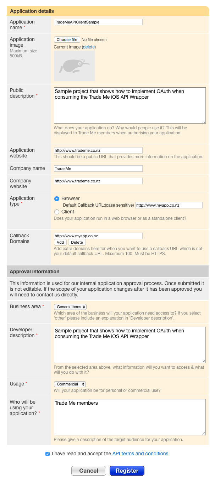
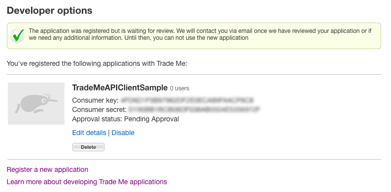

Trade Me API Wrapper
====================

The Trade Me API Wrapper is an iOS wrapper around the online Trade Me API located at [http://developer.trademe.co.nz](http://developer.trademe.co.nz)

This guide is intended to get you started with the API Wrapper in your own project.

We have also included a sample application that shows how to implement OAuth authentication when consuming the Trade Me API.

This guide consists of two parts:

* Installing the API Wrapper
* Running the Sample Application

Installation
------------
> *NOTE*: These instructions assume you are using XCode 4

### Register an application to use with the API

> *NOTE*: While developing and testing your app it is advisable to use Trade Me's sandbox site located at [http://www.tmsandbox.co.nz](http://www.tmsandbox.co.nz)

Point your browser at [http://www.trademe.co.nz](http://www.trademe.co.nz)

Log in to your Trade Me account and navigate to your [My Trade Me page](http://www.trademe.co.nz/MyTradeMe/Default.aspx).

Under the *More options* section, click on the [My applications link](http://www.trademe.co.nz/MyTradeMe/Api/MyApplications.aspx). This will show a list of all the applications you have allowed to access your account.

Click the [Developer options](http://www.trademe.co.nz/MyTradeMe/Api/DeveloperOptions.aspx) link at the bottom. If you have registered any applications to use with the API, this is where they will be shown.

Click the [Register a new application](http://www.trademe.co.nz/MyTradeMe/Api/RegisterNewApplication.aspx) link at the bottom.

Fill out the details for your application. Under the *Application Type* section select *Browser* and set a custom URL callback. This can be used from within your app to determine when the OAuth login process has finished. See the included sample app for details on how to do this.

Trade Me has an internal approval process for all API consumers. Once your application has been approved, when you return to the *Developer options* page, you will see your application in the list along with the *Consumer key* and *Consumer secret* required to make API calls with your application.

### Add AFNetworking and SSKeychain to your project

Prior to using the API Wrapper, both AFNetworking (v 1.1.0) and SSKeychain (v 0.1.4) need to be added to your project.

AFNetworking can be downloaded from
[https://github.com/AFNetworking/AFNetworking/tree/1.1.0](https://github.com/AFNetworking/AFNetworking/tree/1.1.0).

The installation instructions can be found at
[https://github.com/AFNetworking/AFNetworking/wiki/Getting-Started-with-AFNetworking](https://github.com/AFNetworking/AFNetworking/wiki/Getting-Started-with-AFNetworking)

SSKeychain and the installation instructions are available at [https://github.com/soffes/sskeychain/tree/0.1.4](https://github.com/soffes/sskeychain/tree/0.1.4)

### Add the API Wrapper library files to your project

Open your XCode project.

Click 'File -> Add Files to "..."'. An add files dialog will be presented. Navigate to where you have downloaded the API Wrapper.

Select the *TMEClient* directory that contains the *headers* directory and the *libTMEClient.a* file.

Make sure the following options are selected before clicking *Add*:

+ *Destination* Copy items into destination group's folder (if needed) [Checked]
+ *Folders* Create groups for any added folders [Selected]
+ *Add to Targets* The application targets you wish to use with the API wrapper

Import the TMAPI.h header file wherever you want to use the Wrapper (or add it to your '.pch' to have access throughout your project):

	    #import "TMEAPI.h"

In your App Delegate's application:didFinishLaunchingWithOptions: method (or a single place before you start using other API wrapper methods) add the following line.

	[[TMEClient sharedInstance] setConsumerKey:@"CONSUMER KEY GOES HERE" consumerSecret:@"CONSUMER SECRET GOES HERE"];

> The Consumer Key and Secret can be obtained by following the instructions in the *Register an application to use with the API* section.

The iOS Wrapper API endpoint can be configured in the *TMEClient.h* file by changing the following line:

	#define TMEClientBaseURL    @"https://api.trademe.co.nz"

This can be useful if you want to point the API wrapper at the Trade Me sandbox environment located at [http://api.tmsandbox.co.nz](http://api.tmsandbox.co.nz)

The Sample Application
----------------------

> The Sample Application requires AFNetworking (v 1.1.0) and SSKeychain (v 0.1.4) to be added to the project before compiling.

The Sample Application shows how to implement OAuth authentication when using the API Wrapper. It also demonstrates how to make a single API call to fetch the currently authenticated member's details.

Before using the Sample Application, you must follow the steps in the *Add the API Wrapper library files to your project* section.

Once you have added the API Wrapper library, the *Consumer Key* and *Consumer Secret* must be set in the *TMEAppDelegate.m* file:

	#define TMEConsumerKey    @"CONSUMER KEY"
	#define TMEConsumerSecret @"CONSUMER SECRET"

The callback URL configured in the first step (when registering your app) must also be set in the *TMEOAuthViewController.m* file:

	#define TMECallbackURL    @"CALLBACK URL"

Lastly, the *TMEAPI.h* file needs to be imported in the *TradeMeAPIClientSample-Prefix.pch* file by adding the following line:

    #import "TMEAPI.h"

Contact
-------

For any questions regarding the API, please visit our developer website at [http://developer.trademe.co.nz/](http://developer.trademe.co.nz/)

or find us on Twitter at [https://twitter.com/TradeMe_Mobile](https://twitter.com/TradeMe_Mobile)

License
-------

The MIT License (MIT)
Copyright © 2013 Trade Me Ltd [http://www.trademe.co.nz](http://www.trademe.co.nz)

Permission is hereby granted, free of charge, to any person obtaining a copy of this software and associated documentation files (the "Software"), to deal in the Software without restriction, including without limitation the rights to use, copy, modify, merge, publish, distribute, sublicense, and/or sell copies of the Software, and to permit persons to whom the Software is furnished to do so, subject to the following conditions:

The above copyright notice and this permission notice shall be included in all copies or substantial portions of the Software.

You agree that this licence and your use of this Software is subject to the laws of New Zealand, that New Zealand law will apply to any dispute arising from your use of this Software, and you agree to the non-exclusive jurisdiction of the New Zealand courts to hear any such dispute.

THE SOFTWARE IS PROVIDED "AS IS", WITHOUT WARRANTY OF ANY KIND, EXPRESS OR IMPLIED, INCLUDING BUT NOT LIMITED TO THE WARRANTIES OF MERCHANTABILITY, FITNESS FOR A PARTICULAR PURPOSE AND NONINFRINGEMENT. IN NO EVENT SHALL THE AUTHORS OR COPYRIGHT HOLDERS BE LIABLE FOR ANY CLAIM, DAMAGES OR OTHER LIABILITY, WHETHER IN AN ACTION OF CONTRACT, TORT OR OTHERWISE, ARISING FROM, OUT OF OR IN CONNECTION WITH THE SOFTWARE OR THE USE OR OTHER DEALINGS IN THE SOFTWARE.
